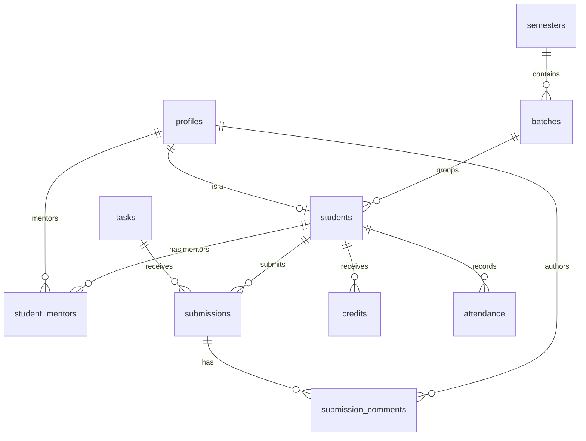

# 🗄️ Database Schema

> Source: [`supabase/migrations/20260626104115_ojt_management_schema.sql`](../supabase/migrations/20260626104115_ojt_management_schema.sql)

---

## Enums

| Enum | Values | Used By |
|---|---|---|
| `user_role` | `ADMIN`, `MENTOR`, `STUDENT` | `profiles.role` |
| `submission_status` | `PENDING`, `ACCEPTED`, `RETURNED` | `submissions.status` |
| `cloud_provider` | `AWS`, `GCP`, `VULTR`, `AZURE`, `OTHER` | `credits.provider` |

> **Frontend-only enums** (not in DB migration yet):
> - `TaskType`: `STUDENT_SPECIFIC`, `MENTOR_SPECIFIC`
> - `SubmissionCategory`: `PRD`, `VIDEO`, `COMMON_TASK`, `SPECIFIC_TASK`

---

## Tables

### `profiles`
User accounts linked to Supabase Auth.

| Column | Type | Constraints | Description |
|---|---|---|---|
| `id` | `uuid` | PK, FK → `auth.users(id)` ON DELETE CASCADE | User ID |
| `email` | `text` | UNIQUE, NOT NULL | User email |
| `name` | `text` | NOT NULL | Display name |
| `role` | `user_role` | NOT NULL, DEFAULT `'STUDENT'` | Account role |
| `created_at` | `timestamptz` | DEFAULT `now()` | Account creation timestamp |

---

### `semesters`
Academic term definitions.

| Column | Type | Constraints | Description |
|---|---|---|---|
| `id` | `uuid` | PK, DEFAULT `gen_random_uuid()` | Semester ID |
| `name` | `text` | UNIQUE, NOT NULL | e.g., "Fall 2024" |
| `start_date` | `date` | NOT NULL | Semester start |
| `end_date` | `date` | NOT NULL | Semester end |
| `is_active` | `boolean` | DEFAULT `true` | Active flag |
| `created_at` | `timestamptz` | DEFAULT `now()` | Creation timestamp |

---

### `batches`
Student groups within a semester.

| Column | Type | Constraints | Description |
|---|---|---|---|
| `id` | `uuid` | PK, DEFAULT `gen_random_uuid()` | Batch ID |
| `name` | `text` | NOT NULL | e.g., "Batch A" |
| `semester_id` | `uuid` | FK → `semesters(id)` ON DELETE CASCADE | Parent semester |
| `created_at` | `timestamptz` | DEFAULT `now()` | Creation timestamp |

---

### `students`
Student-specific metadata (linked to `profiles`).

| Column | Type | Constraints | Description |
|---|---|---|---|
| `user_id` | `uuid` | PK, FK → `profiles(id)` ON DELETE CASCADE | Student's profile ID |
| `roll_number` | `text` | UNIQUE, NOT NULL | Roll number |
| `batch_id` | `uuid` | FK → `batches(id)` ON DELETE SET NULL | Assigned batch |

> **Frontend extends this** with additional fields not yet in the DB migration:
> `semester_id`, `track`, `ojt_id`, `project_id`, `viva1`, `viva2`, `viva3`, `ojt_marks`

---

### `student_mentors`
Many-to-many mapping between students and mentors.

| Column | Type | Constraints | Description |
|---|---|---|---|
| `student_id` | `uuid` | PK (composite), FK → `students(user_id)` ON DELETE CASCADE | Student |
| `mentor_id` | `uuid` | PK (composite), FK → `profiles(id)` ON DELETE CASCADE | Mentor |

---

### `tasks`
Curriculum tasks or mentor-assigned tasks.

| Column | Type | Constraints | Description |
|---|---|---|---|
| `id` | `uuid` | PK, DEFAULT `gen_random_uuid()` | Task ID |
| `title` | `text` | NOT NULL | Task title |
| `description` | `text` | — | Task description |
| `is_common` | `boolean` | DEFAULT `false` | Common to all students? |
| `mentor_id` | `uuid` | FK → `profiles(id)` ON DELETE SET NULL | Assigned mentor |
| `due_date` | `timestamptz` | — | Due date |
| `created_at` | `timestamptz` | DEFAULT `now()` | Creation timestamp |

> **Frontend type** extends with: `type` (STUDENT_SPECIFIC/MENTOR_SPECIFIC), `assigned_to`, `start_date`

---

### `submissions`
Versioned student deliverables.

| Column | Type | Constraints | Description |
|---|---|---|---|
| `id` | `uuid` | PK, DEFAULT `gen_random_uuid()` | Submission ID |
| `task_id` | `uuid` | FK → `tasks(id)` ON DELETE CASCADE | Related task |
| `student_id` | `uuid` | FK → `students(user_id)` ON DELETE CASCADE | Submitting student |
| `version` | `integer` | NOT NULL, DEFAULT `1` | Submission version |
| `file_url` | `text` | NOT NULL | File storage URL |
| `file_name` | `text` | NOT NULL | Original file name |
| `status` | `submission_status` | NOT NULL, DEFAULT `'PENDING'` | Review status |
| `submitted_at` | `timestamptz` | DEFAULT `now()` | Submission timestamp |

> **Frontend type** extends with: `category` (PRD/VIDEO/COMMON_TASK/SPECIFIC_TASK)

---

### `submission_comments`
Comments/feedback on submissions (Google Classroom–style threads).

| Column | Type | Constraints | Description |
|---|---|---|---|
| `id` | `uuid` | PK, DEFAULT `gen_random_uuid()` | Comment ID |
| `submission_id` | `uuid` | FK → `submissions(id)` ON DELETE CASCADE | Parent submission |
| `author_id` | `uuid` | FK → `profiles(id)` ON DELETE CASCADE | Comment author |
| `content` | `text` | NOT NULL | Comment text |
| `created_at` | `timestamptz` | DEFAULT `now()` | Creation timestamp |

---

### `credits`
Cloud provider vouchers assigned to students.

| Column | Type | Constraints | Description |
|---|---|---|---|
| `id` | `uuid` | PK, DEFAULT `gen_random_uuid()` | Credit ID |
| `student_id` | `uuid` | FK → `students(user_id)` ON DELETE CASCADE | Assigned student |
| `provider` | `cloud_provider` | NOT NULL | Cloud provider |
| `amount` | `decimal(10,2)` | NOT NULL | Credit amount |
| `code` | `text` | NOT NULL | Redemption code |
| `expiry_date` | `date` | — | Expiry date |
| `assigned_at` | `timestamptz` | DEFAULT `now()` | Assignment timestamp |

---

### `attendance`
Daily attendance records.

| Column | Type | Constraints | Description |
|---|---|---|---|
| `id` | `uuid` | PK, DEFAULT `gen_random_uuid()` | Attendance ID |
| `student_id` | `uuid` | FK → `students(user_id)` ON DELETE CASCADE | Student |
| `date` | `date` | NOT NULL | Attendance date |
| `marked_at` | `timestamptz` | DEFAULT `now()` | Marking timestamp |

**Unique constraint**: `(student_id, date)` — one record per student per day.

---

## Indexes

| Index | Table | Column(s) |
|---|---|---|
| `idx_batches_semester` | `batches` | `semester_id` |
| `idx_students_batch` | `students` | `batch_id` |
| `idx_submissions_task` | `submissions` | `task_id` |
| `idx_submissions_student` | `submissions` | `student_id` |
| `idx_comments_submission` | `submission_comments` | `submission_id` |
| `idx_credits_student` | `credits` | `student_id` |
| `idx_attendance_student` | `attendance` | `student_id` |

---

## Row Level Security (RLS)

All tables have RLS **enabled** with fully permissive policies for `anon` and `authenticated` roles (SELECT, INSERT, UPDATE, DELETE).

> ⚠️ **Security Note**: The current RLS policies are open for development/staging. Before production, these must be locked down to enforce per-user and per-role access control.

---

## Entity Relationship Diagram

---

## Schema vs. Frontend Type Gaps

The frontend TypeScript types in `src/lib/types.ts` include fields that are **not yet in the database migration**. These need to be added via a new migration before Supabase integration:

| Table | Missing DB Columns | Frontend Type |
|---|---|---|
| `students` | `semester_id`, `track`, `ojt_id`, `project_id`, `viva1`, `viva2`, `viva3`, `ojt_marks` | `Student` |
| `tasks` | `type`, `assigned_to`, `start_date` | `Task` |
| `submissions` | `category` | `Submission` |
| — | Missing table: `ojts` | `OJT` |
| — | Missing table: `projects` | `Project` |
